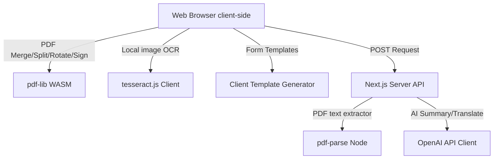

# PDF Studio - Architecture & Feature Reference Guide

This document outlines the detailed system architecture, codebase layout, feature workflows, data privacy model, and SEO implementation for **PDF Studio**.

---

## 1. System Architecture Overview

PDF Studio is designed as a task-first, zero-retention document processing utility. The system balances high-performance client-side operations (to minimize hosting cost and preserve data privacy) with resilient server-side routes for API integrations and fallback processing.



### Key Technical Dependencies
1. **`pdf-lib`**: Loaded dynamically for heavy client-side operations. Handles merging pages, slicing indexes, rotating coordinates, embedding canvases as images, and writing document streams.
2. **`tesseract.js`**: WebAssembly compiled OCR engine. Configured client-side in the browser to run image text extraction locally, bypassing Vercel serverless function timeout limits and ensuring raw files never leave the user's browser.
3. **`lucide-react`**: Vector icon library for modern, premium visual styling.
4. **`pdf-parse`**: Server-side parsing node to extract raw text layers from PDF streams.

---

## 2. Comprehensive Feature Specification

### 2.1 PDF Utility Suite
- **Merge**: Accepts multiple `.pdf` uploads. Users can interactively reorder files in the queue using drag/arrow controls. Returns a merged PDF output using the `copyPages` and `addPage` routines of a single consolidated `PDFDocument`.
- **Split**: Users can visually split PDFs by clicking page card previews in an interactive grid. The system validates index ranges and automatically compiles the split range parameter (e.g. `1-2, 5`), extracting pages client-side using `pdf-lib`.
- **Rotate**: Allows rotating individual pages visually. Clicking a page card thumbnail rotates it 90° clockwise in the browser preview. Modifies the page rotation register in the PDF metadata before compilation.
- **Compress**: Triggers standard stream formatting optimizations, stripping redundant objects and re-indexing references for a smaller file size.

### 2.2 OCR Engine
- **Target Audience**: Business owners, CA firms, and students handling scanned bills, low-quality receipts, certificates, and forms.
- **Languages Supported**: **English**, **Chinese (Simplified & Traditional)**, **German**, and **Hindi (Devanagari)**.
- **Client-Side WASM Execution**: Image OCR is executed 100% client-side inside the user's browser context. The engine loads training language models (`.traineddata` files) directly and caches them locally in the browser's IndexedDB. This bypasses Vercel's 10-second serverless execution limit, provides real-time progress callbacks (e.g. `Recognizing Text: 80%`), and ensures absolute document privacy.
- **PDF Text Layer Extraction**: PDF files are processed server-side via `/api/workflows/ocr` utilizing fast text parsing to extract embedded text layers instantly.

### 2.3 eSign & Digital Audit Trail
- **Legal Compliance**: Designed to align with **Section 5 of the Information Technology Act, 2000 (India)** regarding electronic signatures and tamper-evident documentation.
- **Signature Forms**: Supports hand-drawn signatures (HTML5 Canvas vector track), formatted type signatures (utilizing script and serif font faces), and graphic image uploads.
- **Visual Click-to-Place Board**: Renders an interactive page board matching the document's aspect ratio. Clicking anywhere on the board records the relative X/Y coordinate click and positions the floating signature graphic instantly, eliminating guesswork.
- **Audit Certificate**: Appends a professional "Signing Certificate" page to the end of the document. The page logs the signer's identity metadata (email, phone, time stamp) and computes a unique verification SHA-256 document hash.

### 2.4 Document Templates (MSME Automation)
- **Templates Included**:
  1. **GST Invoice**: Draws clean tax layouts with automatic subtotal, CGST, and SGST breakdowns. Generates and prints a **Scannable UPI Payment QR Code** (encoded with payee UPI ID and billing total) inside the document footer.
  2. **Rent Agreement**: Generates a standard legally binding Indian rental agreement containing descriptions of schedule premises, security deposits, lease terms, utilities maintenance clauses, notice period rules, and witness signatures.
  3. **Student Resume**: Builds a clean, professional academic resume template.
  4. **HR Offer Letter**: Generates a formal internship appointment letter complete with company letterhead, stipend details, and director sign-offs.

### 2.5 AI Summary & Translation
- **OpenAI Integration**: Configured to route calls to the OpenAI API if `OPENAI_API_KEY` is present.
- **Local Fallbacks**: If the API key is absent or throws an error, the backend routes requests to local parsing utilities. Summaries list key concepts and word metrics, and translation actions return structured bilingual previews.

---

## 3. SEO & Discovery Configuration

PDF Studio incorporates deep SEO optimizations to rank for search queries across global and regional markets:

1. **Dedicated Landing Pages**: Refactored to define 7 new statically optimized (SSG) route paths under `/tools/...`. Each tool landing page defines custom `Metadata` (Title, Description, Keywords, OpenGraph).
2. **Schema.org JSON-LD**: Injected structured data (`HowTo` schema showing step-by-step instructions, and `SoftwareApplication` schema detailing operate systems, pricing `0 INR`, and publisher details) to qualify for Google rich search results.
3. **Dynamic Sitemap (`/sitemap.xml`)**: Generated dynamically via `app/sitemap.ts` to index all 8 custom page routes under `https://pdfstudio.site`.
4. **Robots Configuration (`/robots.txt`)**: Declared via `app/robots.ts` to point crawlers directly to the sitemap under `https://pdfstudio.site`.

---

## 4. Development & Deployment Procedures

### Local Setup
```bash
# 1. Install dependencies
npm install

# 2. Start local server
npm run dev
```

### Production Deployment (Vercel)
The project utilizes a `vercel.json` framework configuration:
```json
{
  "framework": "nextjs"
}
```
Deploy to production via CLI:
```bash
vercel --prod --yes
```
This deploys the Next.js target directory seamlessly to `https://pdfstudio.site`.
